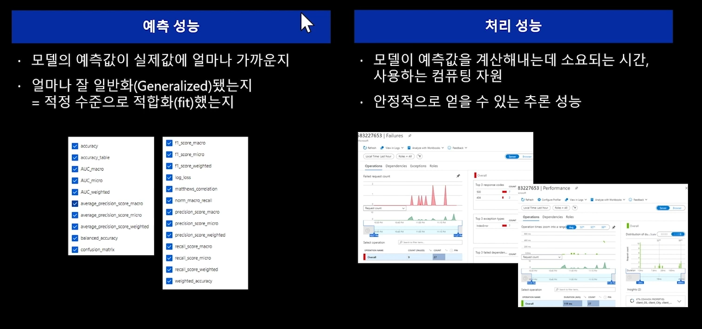

# 애저 듣보잡 요약

머신러닝 프로젝트는 모델을 만드는 것이 전부다?

모델은 3주만에 만들었지만 서비스로 배포하는데 1년이나 걸렸다.

## Ep1 MLOps가 뭐길래

---

### ML 생애 주기

- 파란 부분 : 모델 제작
    - 데이터 사이언티스트
- 녹색 부분 : 서빙 파트
    - 데이터 엔지니어
    - 소프트 엔지니어

### DevOps와의 비교

- DevOps의 핵심
    - 목적을 가진 코드를 컴파일 하고 테스트
    - 서비스 형태로 패키징해서 배포
    - 통합 테스트 운영 배포
    - 반복
- MLOps는 단계가 더 있음
    - 모델
        - 모델을 학습
        - 모델을 배포
    - 데이터
        - 학습 데이터와 알고리즘으로 모델 생성
        - 배포된 모델과 새로운 데이터가 인풋으로 들어가면 새로운 데이터에 대한 예측치가 아웃풋으로 나옴

### 하면 뭐가 좋지?

- 안정적이고 빠르게 Rapid Development
    - 품질 관리를 ML에도 적용
    - 파이프라인 자동화
        - 데이터 가공
        - ML을 Production 데이터와 연계
        - 지속적인 모니터링
        - 재학습/재배포 자동화

### 요약

MLOps 하는 사람들 : 데이터를 다루고 모델링 하는 사람 + 배포 운영하는 사람

DevOps와의 차이 : 데이터에 대한 고려, ML 모델링 + 배포를 일원화

하는 이유 : 성공적인 ML 프로젝트를 위해

## Ep2 ML 생애 주기(1) 데이터 준비

---

- 정의한 문제에 따라 다양한 가설이 있을 수 있음.
- 가설에 따른 데이터 또한 각각 다를 수 있음.
- 따라서 여러 유형의 데이터 셋을 확보할 필요가 있음.
- 마지막으로 확보한 데이터를 모델과 연계해야함.

### 데이터셋 공유 및 재사용

- 데이터의 양도 많지만 종류도 많기 때문에 데이터 공유, 재활용은 중요한 이슈
- 데이터의 다양한 조합을 위한 재가공 과정도 요구될 수 있음.
- 데이터의 출처, 버전 관리, 공유 방법은 중요함

**EXAMPLE**

Azure Machine Learning platform

당뇨병 데이터 정보

- 버전 관리 가능
- 데이터 출처 관리 가능 (Web Url, Tags)
- 파이썬, R을 활용 가능 (Consume)
- 기본 적인 탐색 기능 활용 가능 (Explore)
    - 데이터 형태 Preview(엑셀 처럼 보는 등)
    - 데이터 Profile
        - 데이터 분포 확인
        - 메트릭 분포 확인
        - 분포 및 각종 통계값 확인 가능

### 데이터 탐색/가공

- 데이터를 원하는 형태로 가공
- 몇 가지 체크포인트를 기준으로 데이터 검증 가능

- 데이터 시각화 또한 가능
- 데이터 레이블링도 가능
    - 텍스트, 이미지 데이터 취급 가능
    - 분류, 세그멘테이션, 디텍션 등 도구 제공

### Feature Importance 탐색 (Azure Machine Learing Designer)

- 어떤 피쳐가 중요한 지 탐색
- 데이터의 분포를 감안하여 데이터간의 상관관계 등을 여러 방법론으로 추론 가능

### 요약

- 문제 정의
- 데이터 이동과 연계
- 데이터 탐색 가공 방법

## Ep3 ML 생애 주기(2) 실험/학습

---

- 모델을 **출력**으로 본다면 **입력**은 데이터, 알고리즘, 하이퍼 파라매터가 될 것이다.
- 문제는 처음부터 원하는 모델을 얻을 수는 없기 때문에 실험을 진행한다.
- 입력 3개를 변경해가며 새로운 모델을 만들어 낸다.
    - 데이터
    - 알고리즘
    - 하이퍼 파라매터
- 따라서 이러한 과정에서 최적화는 필요하다.
- 또한 비교 평가도 필요.
    - 최근 3개 모델은 어떤 알고리즘 파라미터로 학습했더라?
    - Feature 변경은 어떤 영향이 있더라?
    - 지난 번에 썼던 스크립트는 어느 버전이었고 그 때의 로그는?

- 실험에 대한 기록은 자세하고도 잘 정리되어야 한다.
- 관리 해야 할 요소들이 아주 많다.
    - 코드 버전
    - 데이터셋 버전
    - 환경 버전
    - …

### 실험 실행

Azure Machine Learning Experiments에는 이 모든 과정을 한 눈에 볼 수 있음.

갖가지 실험들을 한눈에 확인해 볼 수 있는 것 **뿐만 아니라** 실험에 사용 한 데이터의 정보 **또한** 이전 에피소드에서 다뤘듯 쉽게 넘어가서 확인할 수 있다.

한 가지 예

- Accuracy : 지표 성능 확인
- Registered models : 모델 버전 관리
- Deploy status : 배포한 경우 어떤 서비스로 배포했는지 확인 가능

### Automated ML

- 단순히 랜덤하게 실행하기 보다는 더욱 효율 적인 방법 추구
- 입력 조건의 변경에 따라 성능을 미리 예측하고 성능이 좋을 것으로 예측되는 입력 조건을 실행
- 위를 반복적으로 수행함으로써 랜덤 방식보다 빠른 수렴
- 모델 학습 실행 뿐만 아니라 결과 또한 한눈에 분석 가능
    - 각종 메트릭 결과 자동 계산
    - 모델 로그 기록
    - 스냅샷
        - 당시 어떤 로직으로 수행됐는지 저장

### 모델 검증

- 예측 성능
    - 일반적인 ML 모델 성능
    - 얼마나 실제 값을 설명하는가
    - 다양한 메트릭을 기준으로 평가
- 처리 성능
    - 모델이 서비스에서 얼마나 안정적으로 처리하는가
        - 실패한 건수
            - 어떤 경우에서 실패하는 지
        - 성능 이슈
    - 모델을 만드는 사람은 별로 고려 안 할 수 있음
    - Azure에는 Application Insights 툴이 있음

### 요약

- 입력 조건에 따라 최적의 모델을 찾는 실험
- 다양한 실험에 따른 다양한 산출물을 체계적으로 정리하는 것은 중요하다.
- 자동화된 ML은 유용하다.
- 모델의 성능 판단은 예측 성능과 처리 성능이 있다.

## Ep4 ML 생애 주기(3) 모델 해석

“단순하게 설명할 수 없다면, 충분히 제대로 이해한 것이 아니다” - 킹버트 아인슈타인

- 정확도만으로는 더 이상 충분하지 않다.
- 내 모델이 예측을 잘 하는 것 같지만 사실은 완전 착각하고 있는 것일 수 있다.
    
    
    
- 어떻게? 가 중요하다.

### 모델 해석이 왜 중요한가?

- 왜 내 모델이 잘못 예측했나?
- 모델 공정성 판단
    - 데이터 속 bias 분석
- 사람과 AI의 협력
    - 메트릭만을 맹신하지말고 인간이 개입하는 게 더 좋다.
- 규제 및 컴플라이언스
    - 법적인 요건을 지켜야 함.
- 리스크 영역
    - 의료, 금융, 법률 등

### 모델 해석 시도

- azureml.interpret

### 요약

- 모델 해석은 중요하다
    - 늑대 vs 개
- 모델 해석을 위한 여러 시도
- 애져에서 어떻게 통합하는 지

## Ep5. ML 생애 주기 4 - 배포 서빙

---

- 컨테이너 기술을 이용해 서비스를 패키징
- 모델을 만든 환경을 실제 서비스에서도 재현 가능 해야 하기 때문
- 컨테이너 이미지가 포함하는 것
    - 모델
    - 파이썬 패키지 정보
    - 추론 로직
- 서비스를 배포한 후 배포된 서비스의 상태 확인 가능

### 모델 모니터링 : 데이터 드리프트

Data Drift

- 성능을 모니터링 하기 위한 방법 중 하나
- 모델의 예측은 바로 나오지만 그에 대한 정답을 구하는 것은 시간이 걸림
- 따라서 모델의 실제 성능을 바로 알기가 힘듬
- 학습에 사용된 데이터 패턴과 운영에서 얻은 데이터의 분포를 비교
    - 데이터의 패턴 특성이 시간이 지나며 변하는 현상이 있음
    - 학습에 활용된 당시의 데이터와 차이가 커질 수록 예측 성능이 저하될 가능성 있음
    - Data Drift 여부를 지속적으로 모니터링 하면 모델의 재학습 시점을 판단하는 데 간접적인 방법이 될 수 있음
- 성능이 떨어질 수 있는 가능성을 미리 파악하는 것이 Data Drift의 핵심

- 지정된 파라매터에 따라 자동화된 파이프라인 실행 가능.
    - 드리프트가 늘어날 경우 재학습 재배포 과정을 자동화 가능

- 트렌드 확인 가능

### 요약

- 패키징, 배포 개념
- 모니터링 : 데이터 드리프트

## Ep6. MLOps in Action 엿보기

- 전체를 다 다룸 ;;
    - 데이터 파이프라인
    - 모델 제작 평가
    - 더 좋은 모델 등록, 패키징
    - 배포, 모니터링

### EvaluateModel.py

기존 배포 모델보다 새 모델의 메트릭이 더 좋다면,

자동으로 새 모델로 등록, 배포하는 로직

- 모델 등록
- 컨테이너 생성
- 릴리즈
    - 릴리즈 로직도 존재.
        
        
        
        - Test logic도 수행 가능
    - 중간에 사람을 호출하는 트리거도 존재.

- 이 모든 것을 한눈에 확인 가능.
- 각각의 산출물들이 추적 관리 되고 언제든지 코드 등의 방법으로 접근 가능하기 때문에 파이프라인으로 묶을 수 있음.

### 요약
