## MLops란

### 1. ml 생애주기

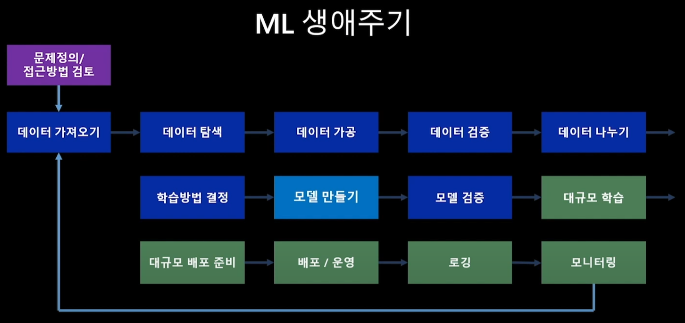

데이터를 서빙하는 과정만 있는 것이 아니라 문제를 정의하고 데이터를 수집, 가공하는 것 그리고 모니터링 후 순환되는 전체적인 과정을 총괄

전반(파란색) -> Data scientists 분야에서 집중

후반(초록) -> data/software engineers 분야에서 집중

### 2. MLops의 Actors

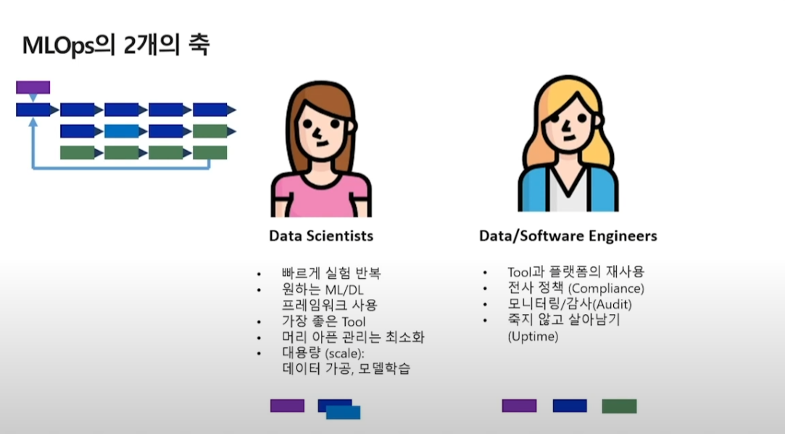

내가 고려해야 할 것을 어떤 것들이 있고, 다른 분야는 어떤 부분을 고민하고 집중하는지 잘 이해해야지 성공적으로 ml프로젝트가 진행될 수 있다.

### 3. Devops와 비교

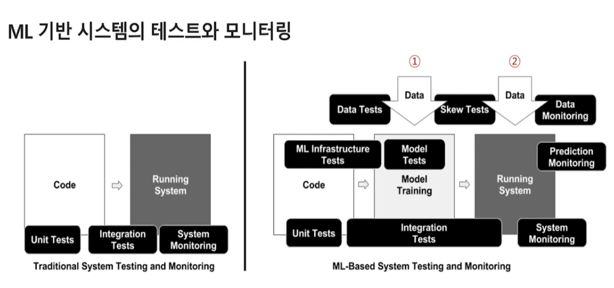

Devops의 핵심적인 목적은 코드를 컴파일하고 테스트하고 서비스 형태로 패키징하고 운영 서비스로 배포. 

이 과정에서 통합적인 테스트, 운영/배포를 반복하는 절차

MLops도 동일하지만, ML과정이 추가됨

Devops +  (모델을 만드는 과정, 모델을 배포하는 과정)

우측 1번은 데이터를 삽입, 2번은 하이퍼파라미터 가공 등 과정이 추가됨

코드와 더불어 데이터도 필요함

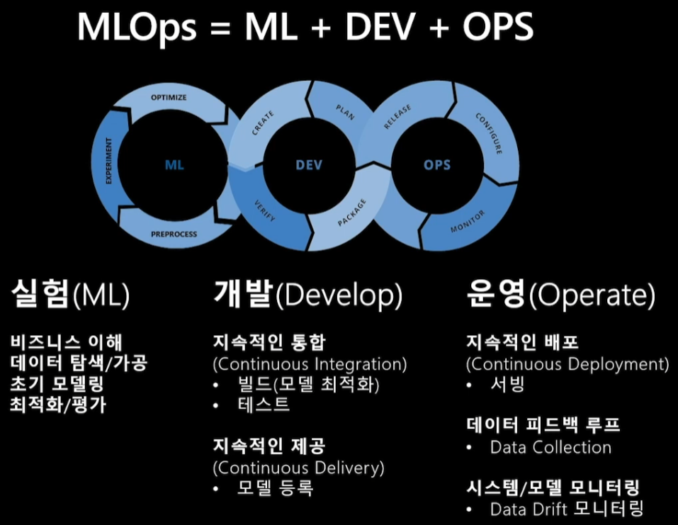

### 4. 왜 MLops를 고려해야 하는가?

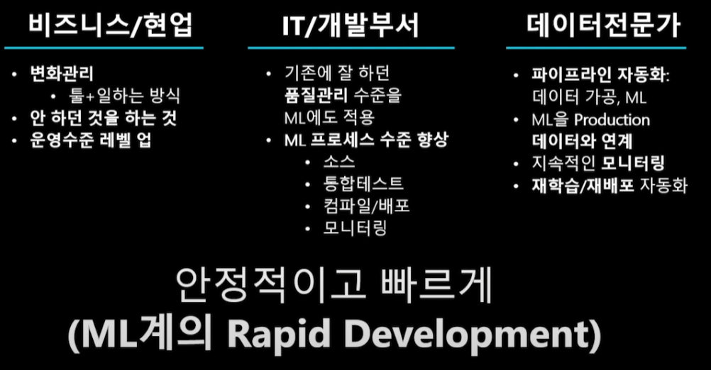

성공적으로 ml프로젝트를 수행하기 위해서.

절차를 따라가면서 하면 오히려 빠르게 프로젝트를 안정적으로 챙겨갈 수 있다.

---

## 생애주기1 - 데이터 준비

### 1. 문제/데이터 정의, 가설 수립

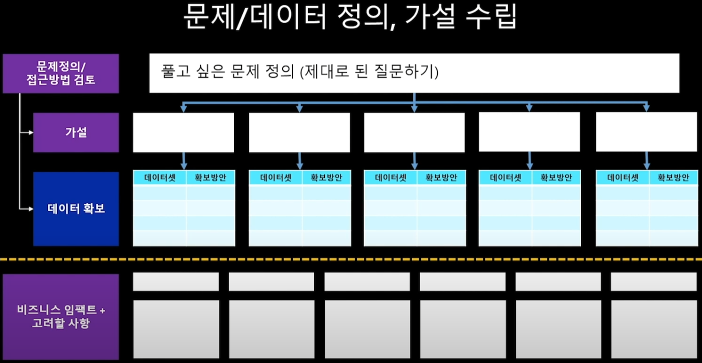

제대로 된 질문 -> 가설 수립 -> 필요 데이터셋 정의 및 확보방법 설립

### 2. 데이터 이동/연계

- 데이터셋 공유 및 재사용

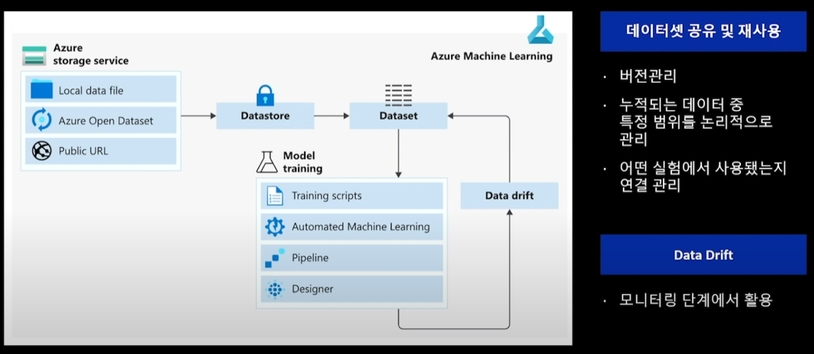

공유하고 재활용하는게 중요

데이터를 어디서 가져왔고 어떻게 사용됐는지 버전관리 역시 중요

### 3. 데이터 탐색/가공

- 데이터셋 및 주피터 노트북에서 탐색
  - 다른 어떤 단계보다도 선행

- 데이터 레이블링
  - 지도학습에 사용되는 이미지 형태의 데이터나 감정데이터 등에 레이블을 달아주는 단계

- Feature Importance 탐색
  - 여러 알고리즘, 접근방법을 통하여 feature간의 중요성을 파악

---

## ml생애주기 - 실험/학습

### 1. 실험, 모델 학습/최적화/비교평가

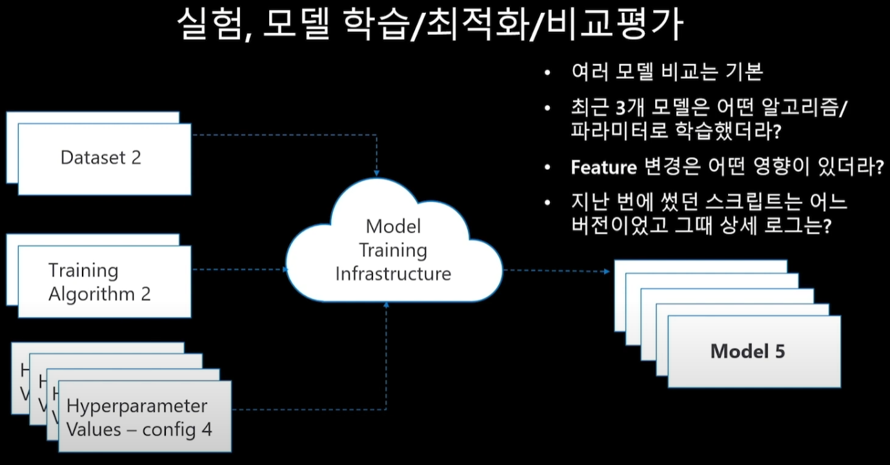

입력 : 데이터, 알고리즘, 하이퍼파라미터

출력 : 모델

재입력 : 새로운, 데이터셋, 하이퍼파라미터 조정, 알고리즘 변경

출력 : 또 다른 모델

여러가지 실험에 따라서 기록을 하는 것이 중요함.

### 2. 실헙 추적관리

- 데이터셋, 코드, 환경, 모델, 서빙 추적
  - 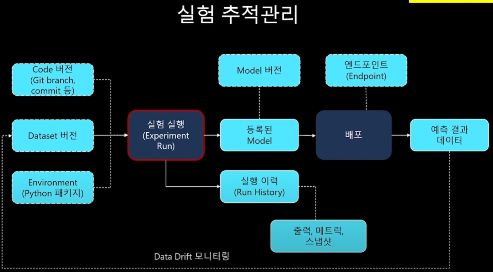
  - 실험을 진행하면서 버전관리가 필수
  - 체계적으로 관리하기 위한 방법을 고안하자

### 3. 자동화된 ml

- 자동화된 ml 엿보기
  - 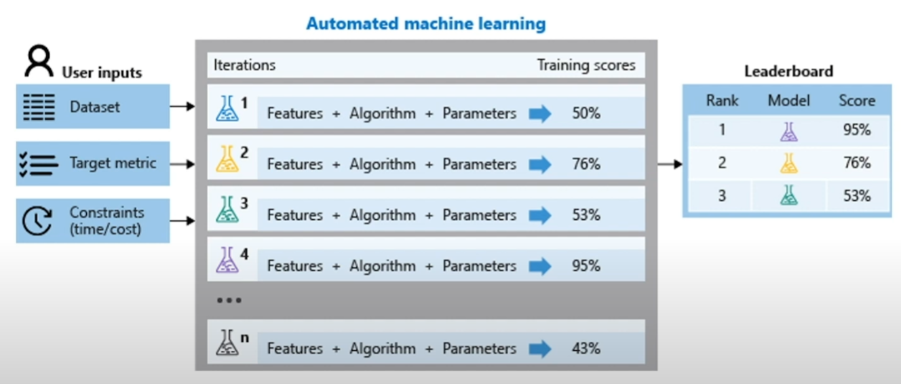
  - 지능적인 방식으로 자동화 되어있어 빠르게 실험을 진행할 수 있다.

### 4. 모델의 검증: 예측성능, 처리성능

- 예측성능
  - 얼마나 실제값에 가까운가

- 처리 성능
  - 얼마나 안정적으로 빠르고 확장이 쉬운방식으로 처리되는가

---

## 생애주기3 - 모델해석

### 1. 모델 해석이 왜 중요한가

모델이 복잡할수록 설명이 어려워짐 -> 사용불가

정확도가 높지만 잘못판단하는 경우가 있음 -> 불완전한 모델해석

상황에 따라 꼭 설명이 수반되는 경우가 있다.

### 2. 모델을 해석하려는 시도

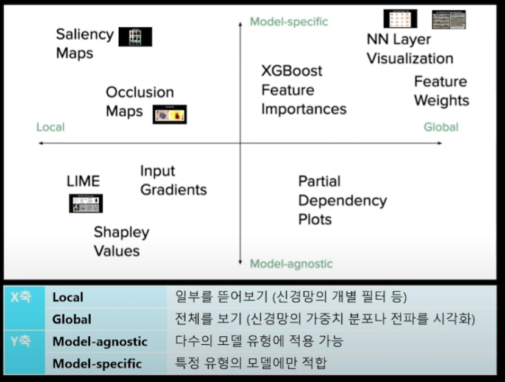

전역적, 지역적 혹은 모델의 구조를 기반으로 모델을 해석

---

## 생애주기 - 배포/서빙

### 1. MLops는 누가 하나

배포/서빙단계에서는 데이터사이언티스트에서 소프트웨어 엔지니어로 사용자가 넘어가는 단계

### 2. 일반적인 Devops와 비교

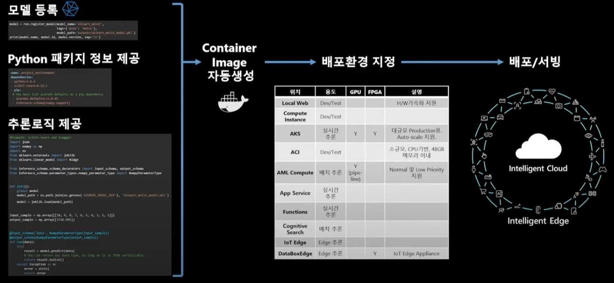

컨테이너를 사용하는 이유 : 모델이 만들어진 환경과 인퍼런스하는 환경을 동일시하기 위하여

 패키징을 통하여 재활용이 가능한 형태로 배포

