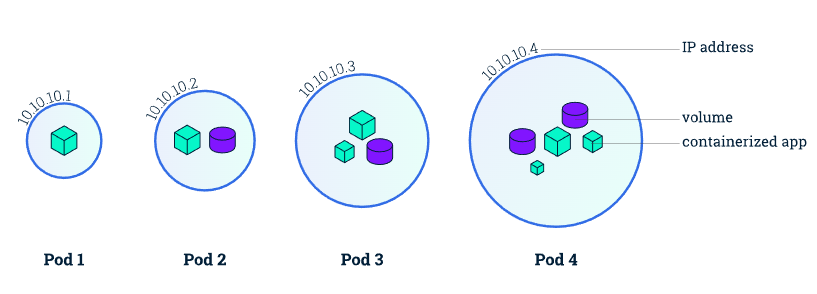
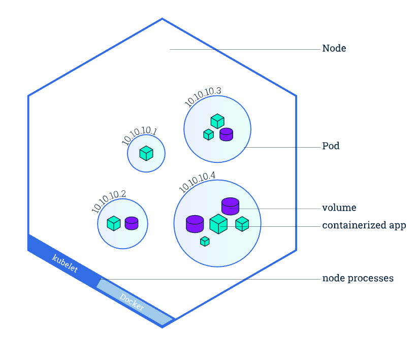
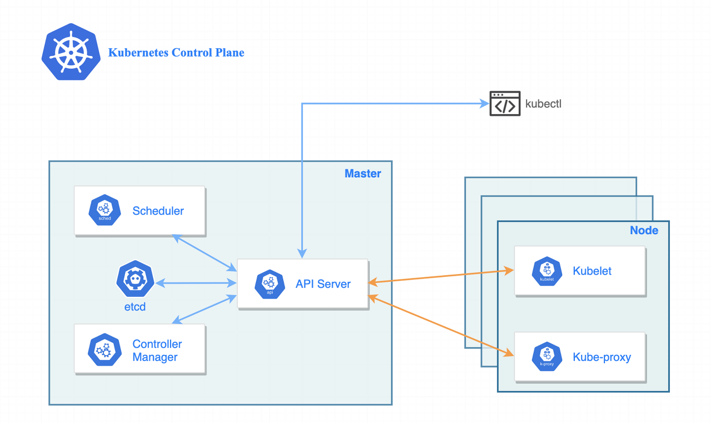
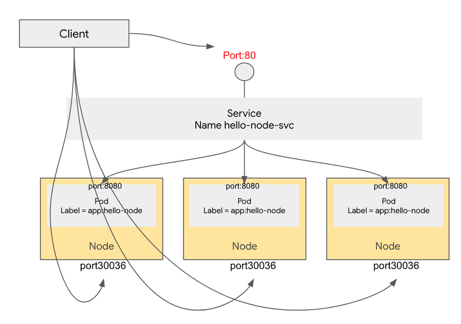

# K8s 기초

### 쿠버네티스란?

컨테이너의 자동화된 배포, 스케일링 등을 관리하는 시스템

대충 사람이 하는 일 기계한테 맡기는 것

## Pods And Nodes

---

쿠버네티스 마스터는 워커 ‘머신’인 노드 위에 개별 포드들을 올려 개별 어플리케이션을 실행한다.

### Pod

*대부분의 포드는 1개의 컨테이너로 온전한 어플리케이션 역할을 수행*

- 한 개 이상의 컨테이너 그룹을 Pod라고 한다.
- 쿠버네티스는 컨테이너 단위가 아닌 포드 단위로 클러스터를 관리한다.
- 포드는 쿠버네티스 플랫폼의 가장 작은 단위이다.
- 하나의 포드는 온전한 하나의 어플리케이션이 된다.
- 포드 내의 컨테이너들은 공유 스토리지 (Volumn), 네트워크 (Cluster IP), 실행 정보 (container Image version, ports …)를 공유한다.

### Node

*노드가 모여 쿠버네티스 클러스터를 구성*

- 노드는 쿠버네티스 워커 머신이다. (가상, 물리 둘다)
- 각 노드는 마스터에 의해 관리되며, 노드들과 마스터가 쿠버네티스 클러스터를 구성한다.
- 모든 포드는 노드 위에서 동작하고, 하나의 노드는 여러 개의 포드들을 가질 수 있다.

- 마스터 노드
    - 마스터 노드에서는 클러스터를 관리하고 클러스터의 기능을 실행한다.
    - 단일 마스터 노드에서 실행하거나 여러 노드로 분할 및 복제되어 고가용성을 보장할 수 있는 여러 구성요소로 구성될 수 있다.
    - API Server : 사용자와 컨트롤 플레인과 통신하는 쿠버네티스 API
    - Scheduler : 애플리케이션을 예약하는 스케줄러로, 배포 가능한 각 구성 요서에 워커 노드 할당을 담당
    - Control Manager : 구성 요소 복제, 워커 노드 추적, 노드 장애 처리 등 클러스터 기능을 실행
    - etcd : 클러스터 구성을 저장하는 분산 데이터 스토리지
- 워커노드
    - 워커 노드는 컨테이너화된 어플리케이션을 실행하는 시스템으로 서비스 실행, 모니터링을 제공한다.
    - Kubelet : API 서버와 통신하고 노드에서 컨테이너를 관리
    - Kube-proxy : 어플리케이션 구성 요소 간에 네트워크 트래픽을 분산하는 쿠버네티스 서비스 프록시

## Workload Resources

---

Pod를 일일이 관리하는 것은 고되고 번거로운 작업이다.

그래서 쿠버네티스에서는 Pod 집합을 관리하기 위한 Workload Resources를 사용한다.

각 Resource는 Pod가 지정한 상태와 일치하는지 확인한다.

### ReplicaSet

ReplicaSet의 목적은 replica pod 집합의 실행을 항상 안정적으로 유지하는 것이다. 

이처럼 ReplicaSet은 보통 명시된 동일 Pod 개수에 대한 가용성을 보증하는데 사용한다.

예를들어 5개의 Pod를 항상 실행 하도록 설정하면 이후 Pod 1개가 삭제될 경우 다시 Pod 1개가 실행되어 5개를 유지할 수 있도록 해준다.

### Deployment

레플리카셋의 상위 개념으로 볼 수 있음.

레플리카셋, 포드의 배포를 관리한다.

- 쿠버네티스 내 어플리케이션 인스턴스의 생성 및 업데이트 방법 지시
- 포드의 헬스를 검사하여 포드의 컨테이너 종료 시 재시작
    - Pod의 한계를 극복하기 위해 존재
- 버전 업데이트 등으로 인해 원하는 정의가 변경되면 현재 상태에서 원하는 상태로 바뀌도록 변경한다.
    - 변경 사항을 저장하는 revision을 남겨 문제 발생 시 이전 버전으로 롤백도 가능하다.

### StatefulSet

Deployment와 달리 Stateful한 Pod를 관리하기 위한 컨트롤러.

따라서 Pod들의 고유성과 순서를 보장.

- Database는 마스터 노드가 가동된 후 워커 노드가 순차적으로 기동되어야하는 경우가 많아 이 경우 사용한다.
- 개별 포드가 Persistent Volumn(PV)을 생성하여 연결하도록 실행한다.
    - Pod가 비정상 종료된 경우 새 Pod가 기존 Pod에 연결된 PV를 담당하게 된다.

### DemonSet

클러스터를 운용하는데 기본적인 노드-로컬 기능(node-local facilities)을 제공하는 Pods를 정의한다.

- 노드 모니터링, 데몬, 로그 수집 데몬, 클러스터 스토리지 데몬 등을 실행하는 데 사용.
- 일부 혹은 모든 노드가 Pod의 사본을 실행하도록 한다.
- 일부 혹은 모든 노드가 항상 실행해야 할 특정 Pod를 관리한다.

### Job & CronJob

- Job은 하나 이상의 포드를 지정하고 지정된 수의 포드를 성공적으로 실행하도록 하는 설정
    - 성공적으로 종료될 때 까지 포드의 실행을 재시도 한다.
    - 노드의 H/W 장애나 재부팅 등으로 인해 포드가 정상 실행이 되지 않았을 경우 Job은 새로운 파드를 시작하도록 할 수 있다.
- CronJob은 반복 일정에 따라 Job을 생성한다.
    - ex) 매일 오후 6시에 특정 파드를 실행시킨다.

Job을 삭제해야 Job이 생성한 포드가 정리된다.

## Service

---

쿠버네티스의 포드는 언제든지 생성되거나 삭제될 수 있는 비영구적인 리소스이다.

따라서 가변적인 IP가 아닌 다른 방식으로 포드에 접근할 수 있어야 한다.

쿠버네티스에서는 서비스라는 오브젝트를 이용한다.

- 서비스 종류
    - ClusterIP
        - 디폴트 설정
        - 서비스에 클러스터 IP를 할당한다.
        - 클러스터 내에서는 이 서비스에 접근이 가능하지만, 외부에서는 외부 IP를 할당 받지 못했기 때문에 접근이 불가능하다.
    - NodePort
        - 클러스터 IP로만 접근이 가능한 것이 아니라, 모든 노드의 IP와 포트를 통해서도 접근이 가능하게 된다.
        
        
        
        - 위 그림의 경우 클러스터 IP의 80 포트로도 접근이 가능하고, 모든 노드의 30036 포트로도 서비스를 접근할 수 있다.
    - LoadBalancer
        - 클라우드 벤더에서 제공하는 설정 방식으로, 외부 IP를 가지고 있는 로드밸런서를 할당한다.
            - 클라우드 벤더 : 클라우드 컴퓨팅 서비스 솔루션 제공 업자
        - 외부 IP를 가지고 있기 때문에, 클러스터 외부에서 접근이 가능하다.