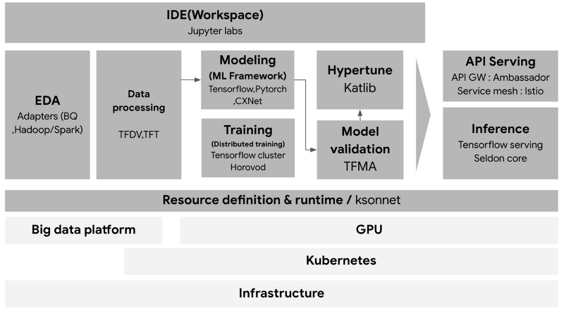
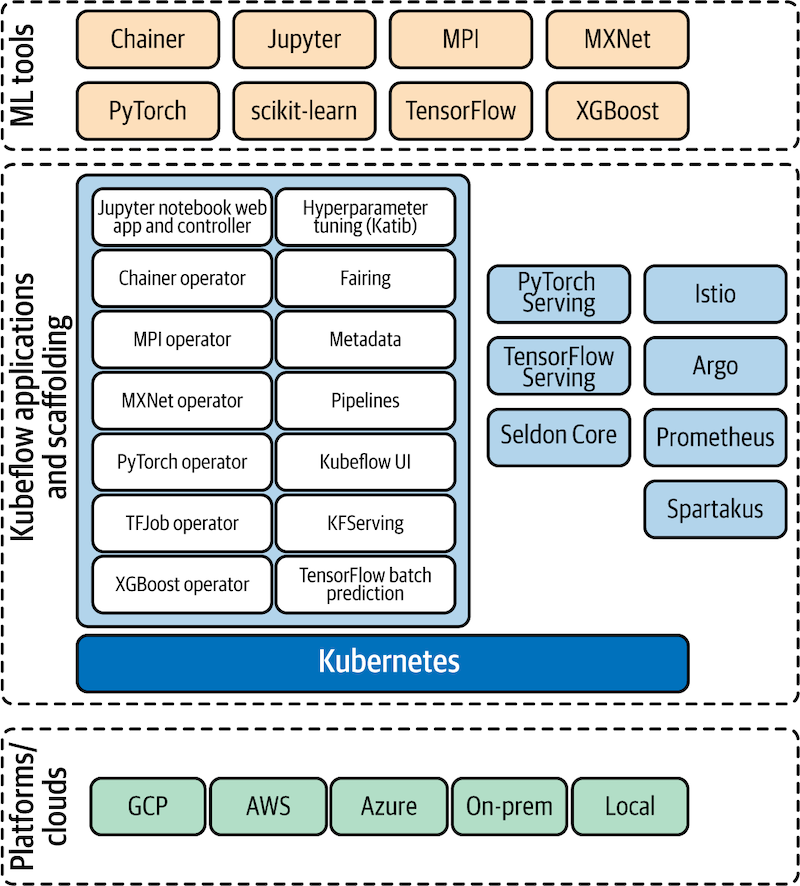
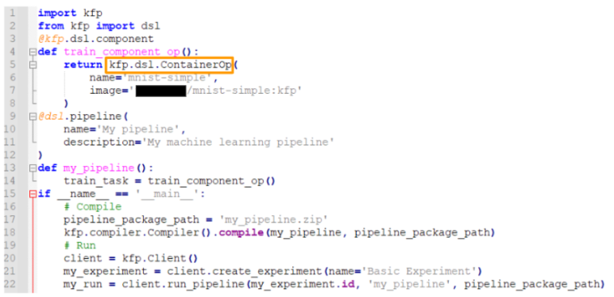
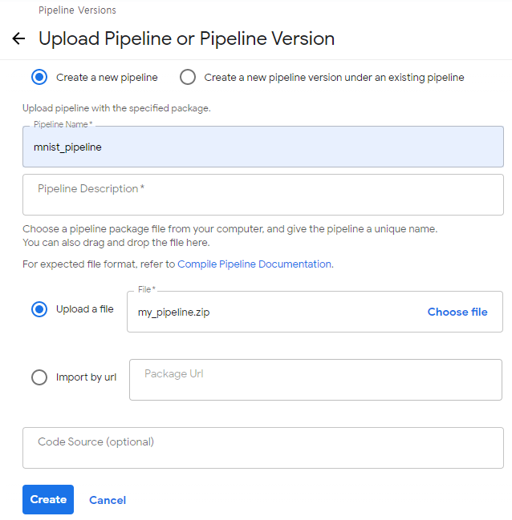

# Kubeflow 기초

*“Kubeflow helps you organize your ML workflow”*

Kubeflow = Kubernetes + machine learning flow

- Kubeflow 의 목적은 머신러닝 워크플로우를 Kubernetes 에 배포하는 것을 단순화 시키는 것
- Kubeflow 가 해결하는 문제
    - 더 빠르고 일관된 배포
    - 더 강력한 보안을 위한 포트 및 구성 요소 액세스에 대한 더 나은 제어
    - 과잉 프로비저닝 리소스로부터 보호, 비용 절감
    - 완료 후 할당이 해제되지 않는 작업으로부터 보호하여 비용 절감
    - 워크플로우 오케스트레이션 및 메타 데이터 수집
    - 중앙 집중식 모니터링 및 로깅
    - 모델을 안전하게 대규모로 프로덕션으로 이동하기위한 인프라
    - **AI 조직을 대규모로 관리하면서 동일한 제어 품질을 유지할 수 있음**

## Kubeflow에서 제공하는 기능들

---

- Central Dashboard
    - Kubeflow 대시보드
    - Kubeflow 상황을 모니터링 할 수 있음
- Notebooks
    - 주피터 노트북
- Tensorboards
    - 모델 학습 추적 및 시각화
- Volumes
    - 작업공간 할당 현황
- Experiments (AutoML) : Katib
    - 하이퍼 파라미터 튜닝
    - 신경망 구조 검색
    - Pytorch 지원
- Experiments (KFP)
    - 생성한 Experiments를 볼 수 있음.
- Pipelines
    - 파이프라인 설정. Experiments 생성은 여기서.
- Runs
    - 파이프라인 실행 상태 확인
- Artifacts
    - 생성된 아티팩트 저장소
- Manage Contributors
    - 사용자 관리

## Kubeflow 기초 파이프라인

---

파이프라인은 Kubeflow Pipelines SDK를 사용하여 작성한다.

- Kubeflow Pipelines SDK
    - 머신러닝 워크 플로우를 정의하고, 실행시킬 수 있는 파이썬 패키지 세트.
    - `import kfp`로 로드 할 수 있다.

### 파이프라인 생성 및 실행하는 단계

1. 컴포넌트 생성
2. 도커 이미지 생성
3. 파이프라인 코드 작성
    - kfp를 사용한 파이프라인 코드 작성
    
    
    
    - kfp.dsl
        - 파이프 라인의 각 step을 구성할 때 사용되는 클래스, 모듈 등의 라이브러리.
    - kfp.dls.ContainerOp()
        
        컨테이너 이미지로 구성된 파이프라인 한 step
        
        - name
        - image
            - 사용할 컨테이너 이미지 이름
        - command
            - 컨테이너 이미지 실행 명령어
        - arguments
            - 컨테이너 이미지 실행 인자 값
        - file_outputs
            - 컨테이너 결과를 외부로 노출시킬 때 사용
        - pvolumes
            - volume을 컨테이너 경로에 마운트
    - kfp.Clinet()
        - kubeflow pipelines API 접근
    - kfp.compiler.Compiler().compile()
        - 해당 파이프라인 함수 compile
    - client.get_pipeline_id()
        - 현재 파이프라인 이름을 가진 파이프라인이 존재하는지 확인
    - client.upload_pipeline_version(), client.upload_pipeline()
        - 파이프라인 신규/버전 업로드
    - client.create_experiment()
        - experiment 생성 및 기존 experiment 접근
    - client.run_pipeline()
        - 파이프라인 run
4. 파이프라인 코드 실행
5. 웹에 업로드
    
    
    
    - 파이프라인 새로 만들기
    - 파이프라인 이름 짓고 컴파일된 압축 파일 업로드
6. 파이프라인 테스트