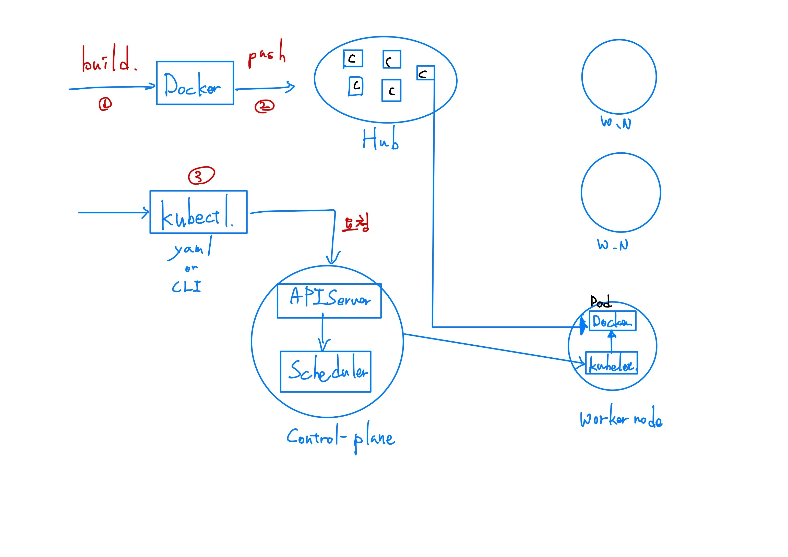

# **kubectrl command**

```
kubectrl [command] [~~]
```

```shell
# container 실행
$ kubectl run [name] --image=[]

# 컨테이너 여러 개 실행
kubestl create deployment [name]


# container 상세 표시
$ kubectrl describe pod [name] --image=[] --replicas=[count]

# 생성 확인
$ kubectl get pods

# 컨테이너에 들어가기
$ kubectl exec [name] --it

# 로그 확인
$ kubectl logs [name]
```

# **쿠버네티스 아키텍처**

## **k8s 동작원리**

### **Flow**



- Control-plane
  - API
    - kubectl 명령을 받고, 실행.
  - etcd
    - worker nodes의 상태 정보 저장소.
  - Scheduler
  - Controller
- worker node
  - kubelet
    - daemon 형태로 실행
- Add-on
  - 네트워크
  - dns
  - 대시보드
  - 컨테이너 자원
  - 클러스터 로깅

## **namespace**

- 클러스터 하나를 여개의 논리적인 단위로 나눠서 사용.
- 클러스터 하나를 여러 사용자가 함께 공유.
- API가 여러 개가 실행되는 것 처럼.

```shell
# namespace 확인
$ kubectl get namespaces
$ kubectl get pods --all-namespaces

# namespace 생성
# CLI
$ kubectl create namepsace [name]
# yaml
$ kubectl create -f [file-name]
```

## **yaml, API**

```shell
# version 확인
$ kubectl explain pod
```
