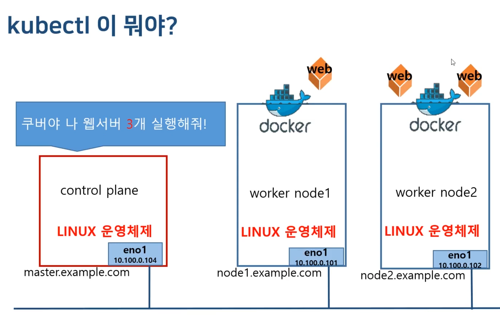
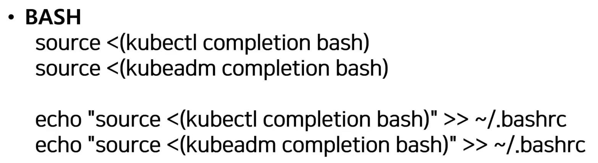
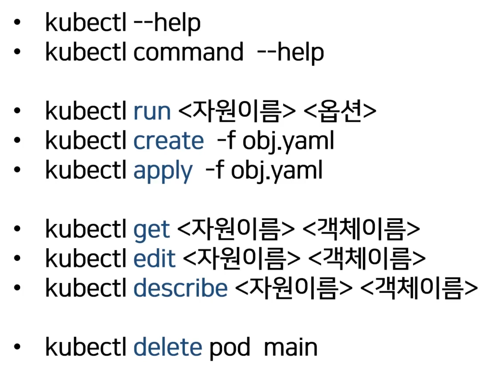
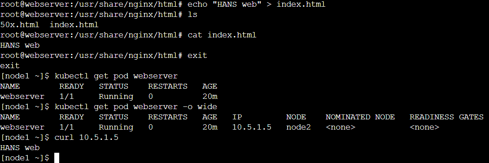
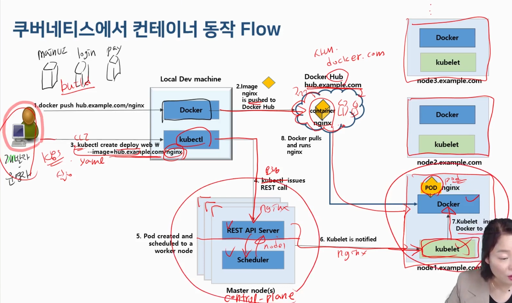
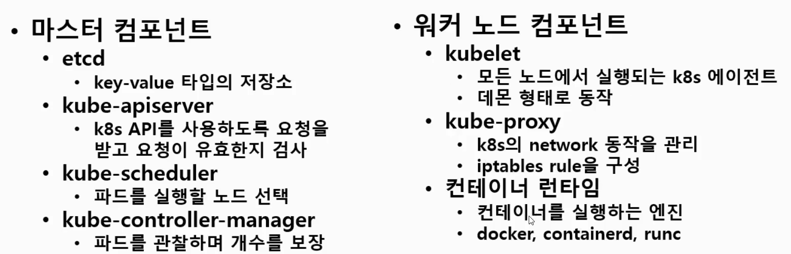
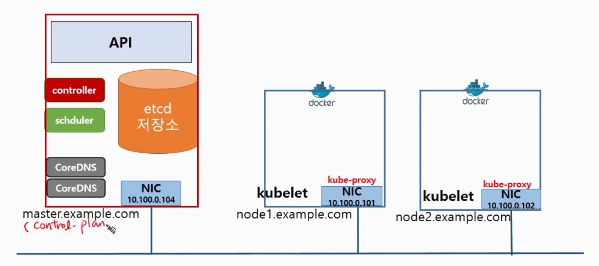
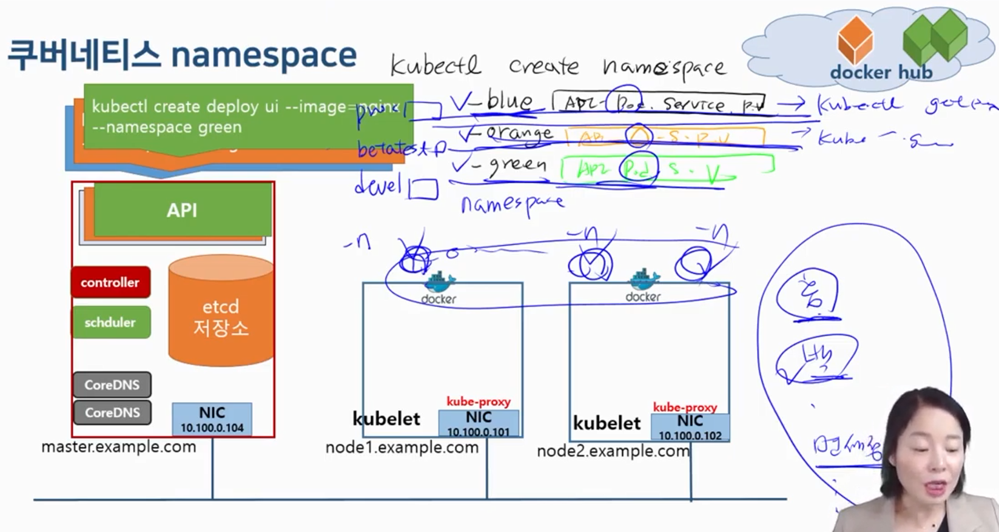
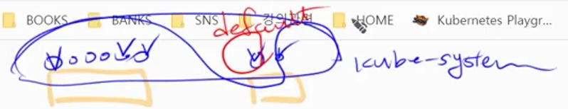
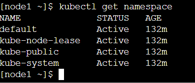

## Kubectl

---

## Kubectl 명령어 구조

---

### Kubectl [command] [TYPE] [NAME] [flags]

- command
    - 자원(object)에 실행할 명령
    - create, get, delete edit
- TYPE
    - 자원의 타입
    - node, pod, service
- NAME
    - 자원의 이름
    - 소문자 숫자 대시문자만 가능
- flags
    - 부가적으로 설정할 옵션
    - —help, -o options

kubectl get pod webserver -o wide

=쿠버네티스야 ‘웹서버’ 파드 정보 좀 자세하게 알려줘

## Kubectl 명령어 자동 완성

---

Tab키를 이용해 자동 완성 하는 법

## Kubectl commands

---

## Kubectl pod 생성하기

### kubectl run webserver —image=nginx:1.14 —port 80

webserver라는 이미의 nginx:1.14 컨테이너 이미지를 사용해서 만들어줘 그리고 80번 포트를 열어줘

- port
    - 웹서버 프로그램은 프로그램이 실행되면서 80 포트를 열어 클라이언트 커넥션이 들어오도록 listen 대기하는 프로그램이다.
- 보통 대시가 두개 있는 옵션들은 옵션을 풀어서 씀
    - —help, —port

### pods 정보 확인하기

`kubectl get pods` 

`kubectl get pods webserver`

- webserver만 보여줘

`kubectl get pods -o wide`

- 자세하게 보여줘

`kubelctl describe pod webserver`

- 더 자세하게 보여줘

### webserver에 접속하기

`curl [IP Address]`

- 리눅스 웹 브라우저임

### Pod 더 만들어보기

`kubectl run`

- 한 개만 만들 때 사용

`kubectl create deployment mainui —image=httpd:latest(생략가능) —replicas=3`

- 여러 개 만들 때 사용
- httpd mainui를 3개 실행해줘

`kubectl get deployments.apps`

### Pod 실행하기 (컨테이너 내부로 들어가기)

`kubectl exec webserver -it — /bin/bash`

- exec는 pod에만 사용하기 때문에 kubectl exec pod 이렇게는 안함
    - 따라서 명령어 기본 구조 중 TYPE 생략

이런 식으로 내부에 접속해서 이런 저런 짓 가능

`kubectl port-forward webserver 80:80`

- 마스터 시스템의 80으로 들어오면 80포트로 forwarding 시켜주겠어
- 이것도 pod에만 실행 가능

`kubectl run webserber —image=nginx:1.14 —port 80 —dry-run`

- 실행하는 것이 아닌 실행이 되는지 안 되는지 체크만 함

`kubectl run webserber —image=nginx:1.14 —port 80 —dry-run -o yaml > webserver-pod.yaml`

- 실행할 수 있는 상태를 yaml파일로 저장

`kubectl delete pod webserver`

- pod 삭제
- 컨테이너도 날라감

`kubectl create -f webservser-pod.yaml`

- yaml 파일로 파드 실행
- 이렇게 하면 귀찮게 run —image 이런 거 안 쓰고 미리 만들어 놓은 파일로 실행 가능

### 수정하기

`kubectl edit deployments.apps mainui`

- vi 편집기 실행

## 쿠버네티스 아키텍쳐

## 쿠버네티스 컴포넌트

## K8s namespace

namespace를 만들고 각 namespace에 API를 만든다.

물리적으로는 하나인데 논리적으로 여러 개인 것처럼 관리한다.

pod들이 아주 많을 때 특정 namespace 별로 분류하여 관리하기 편하게 하기 위해 사용

- namespace
    - CLI
        - `kubectl create namespace blue`
        - `kubectl get namespaces`
    - yaml
        - `kubectl create namespace green —dry-run -o yaml > green-ns.yaml`
        - `vim green-ns.yaml`
        - `kubectl create -f green-ns.yaml`
- namespace 관리
    - `kubectl get namespace`
    - `kubectl delete namespace`
- 쿠버네티스가 기본적으로 만드는 namespace
    
    
    
    추가적인 namespace를 지정하지 않으면 default namespace에서 명령어가 실행된다.
    
    `kubectl config use-context kubernetes-admin@kubernetes`
    
    등의 명령어로 defalut namespace switch 가능
    
- namespace 삭제
    
    `kubectl delete namespaces blue`
    
    - namespace를 제거하면 namespace 안의 pod, service, API 등 모든 것이 삭제된다.
    

## yaml 템플릿과 API

### **yaml**

- 사람이 쉽게 읽을 수 있는 데이터 직렬화 양식
- 기본 문법
    - 구조화된 데이터를 표현하기 위한 데이터 포맷
    - python 처럼 들여쓰기로 데이터 계층 표기
    - 들여쓰기를 할 때 Tab이 아닌 Space bar 사용
    - 가독성이 좋아 설정 파일에 적합함
    - Scalar 문법 : ‘:’을 기준으로 key: value를 설정
    - 배열 문법 : ‘-’ 문자로 여러 개를 나열

### API version

- alpha → beta → stable
- kubernetes object 정의 시 apiVersion이 필요
- Kubernetes가 update하는 API가 있으면 새로운 API 생성됨
- API Object의 종류 및 버전
    - Deployment  :  apps/v1
    - Pod  :  v1
    - ReplicaSet  :  apps/v1
    - ReplicationController  :  v1
    - Service  :  v1
    - PersistentVolume  :  v1