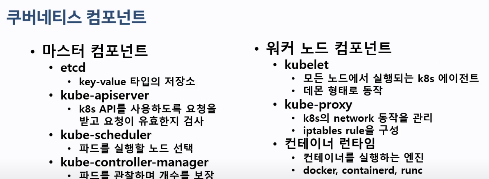
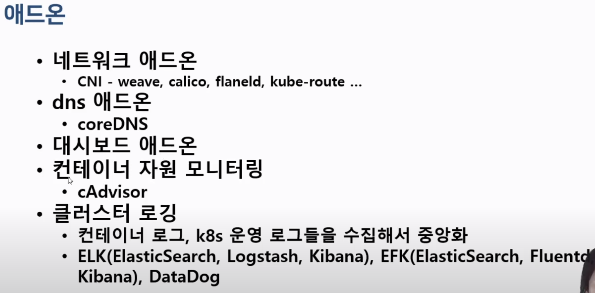
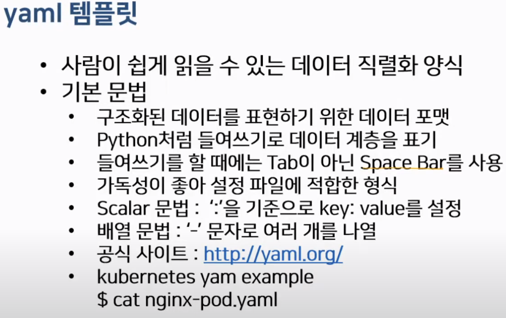
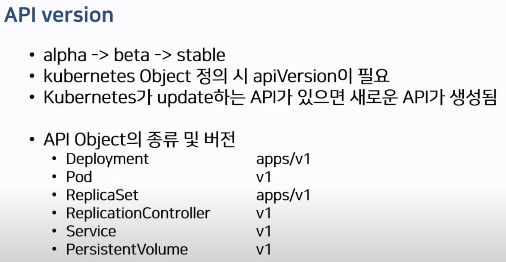

## kubectl

### kubetctl 명령어 기본 구조
```bash
kubectl [command] [TYPE] [NAME] [flags]
# command -> 자원에 실행할 명령(create, get, delete, ...)
# TYPE -> 자원의 타입
# NAME -> 자원의 이름
# 대괄호는 생략 가능
```

```bash
# 커맨드 자동완성
source <(kubectl completion bash)
source <(kubeadam completion bash)

echo "source <(kubectl completion bash)" >> ~/.bashrc
echo "source <(kubeadam completion bash)" >> ~/.bashrc
```

```bash
# node, nodes, pod, pods 상관 없다.
kubectl get node

# 설명을 듣고싶다면 뒤에 --help를 붙여쓰자.
kubectl logs --help
kubectl --help

# node의 자세한 설명
kubectl get nodes -o wide
kubectl describe node [node name]
```

```bash
# pod의 자세한 설명
kubectl get pods -o wide
kubectl describe pod [pods name]

# yaml 파일로 출력
kubectl get pods pod [pods name] -o yaml

# json 파일로 출력
kubectl get pods pod [pods name] -o json
```

```bash
# 파드 생성, 실행
kubectl run [pods name] --image=[image] --port [port]

# 생성 전 체크
kubectl run [pods name] --image=[image] --port [port] --dry-run

# 생성 전 체크 -> yaml 파일로 변환
kubectl run [pods name] --image=[image] --port [port] --dry-run -o yaml > webserver_pod.yaml


```


```bash
# pod가 연결이 되지 않을때 port-forwarding
kubectl port-forward [pod] [host-port:pod-port]
```

```bash
# replicas 
kubectl create deployment mainui --image=httpd --replicas=3
```

```bash
# 내부접속, -- 다음에는 컨테이너 내부에서 실행할 명령어를 서술
kubetctl exec webserver -it -- /bin/bash
```

```bash
# 실행중인 api resource를 수정할때 사용
kubectl edit deployments.apps mainui

# 사용 후 vim으로 수정 -> 저장
```

```bash
# 파드삭제
kubectl delete pod [pods name]
```

<br>
### 궁금한점..?
- kubectl apply vs create  

|cmd|리소스 존재하지 않는 경우|리소스가 존재하는 경우|
|---|---|---|
|create|새로운 리소스 생성|error 발생|
|apply|새로운 리소스 생성| 리소스를 구성(부분적인 spec 적용)|


<br>

------

<br>

## 4-1 쿠버네티스 아키텍쳐 동작원리

1. 도커허브에 이미지 push
2. kubectl을 사용하여 push한 이미지를 전달
3. Master-Node(API-server)로 전달된 명령이 scheduled하고 Scheduler는 node의 상태를 파악하고 API-server에 전달.
4. Kubelet에 전달된 요청은 도커 명령으로 변환하여 컨테이너 생성

<br>  

### 마스터 컴포넌트



1. kubectl 요청을 api가 수령
2. (문법, 권한이 맞다면) etcd 저장소를 확인
3. scheduler에게 요청 -> 어느 노드에서 가장 합당한지
4. scheduler에게 반환받은 정보를 가지고 kubelet에 요청
5. docker engine에 요청
6. (노드가 죽었다면) controller가 확인 후 api-server에 재요청 -> 개수를 보장한다.


<br>



필요한 것은 찾아서 더 설치하자..!

<br>

-----

<br>

## 4-2 쿠버네티스 아키텍쳐 - namespace

<br>

- 논리적으로 나눠쓰는 개념
- 물리적인 클러스터는 하나지만 논리적으로 여러개로 나누어 동작시킴
- --namespace, -n 으로 표현


```bash
# CLI
kubectl create namespace blue
kubectl get namespaces

# yaml
kubectl create namespace green --dry-run -o yaml > green-ns.yaml
# vim -> :set number하면 보기 편하다..!
vim green-ns.yaml
kubectl create -f green-ns.yaml

# namespace 관리
kubectl get namespace
kubectl delete namespace
```


- default, kube-node-lease, kube-pulick, kube-system 은 defeault로 생성되어있는 namespace.
- 따로 namespace를 할당하지 않은 pods는 default namespace로 할당됨.

<br>


```yaml
# namespace를 만드는 기본적인 yaml 파일
apiVersion: v1
kind: Namespace
metadata:
    name: orange
```
위처럼 만든 namespace에 
```bash
kubectl create -f nginx.yaml -n orange
```
```yaml
apiVersion: v1
kind: Pod
metadata:
  name: mypod
spec:
  containers:
  - image: nginx
    name: nginx
    ports:
    - containerPort: 80
    - containerPort: 443
```
을 통하여 삽입시킬 수 있고

아예 metadata의 namespace로 할당할 수 있다.
```yaml
apiVersion: v1
kind: Pod
metadata:
  name: mypod
  Namespace: orange
spec:
  containers:
  - image: nginx
    name: nginx
    ports:
    - containerPort: 80
    - containerPort: 443
```

기본적으로 사용하는 namespace를 default가 아닌 다른 이름을 switch  
- 방법
    - namespace를 포함한 context등록
    - 등록된 namespace로 context 변경
    ```bash
    # context 생성
    kubectl config set-context [orange@kubernetes] --cluster=minikube --user=minikube --namespace=orange
    # default context 변환
    kubectl config use-context orange@kubernetes
    ```

<strong>네임스페이스 삭제시 관련 네임스페이스가 사라진다.</strong>

<br>

## 4-3 쿠버네티스 아키텍쳐 - yaml
<br>


<br>



```bash
# apiVersion 모를때 검색
kubectl explain [service]
```