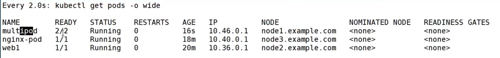

# 따배쿠 5-1 [Pod container 정리]

## 쿠버네티스가 가장 기본이 되는 Pod

---

### Container 정리

컨테이너 하나 = 어플리케이션 입니다.

도커에서는 컨테이너를 위 그림과 같이 빌드하고 동작 시키는데 쿠버네티스에서는 어떻게 동작 시킬까요?

### Pod란?

쿠버네티스는 Pod라는 단위를 통해서 컨테이너를 동작 시킵니다.

즉, Pod는 컨테이너를 표현하는 K8s API의 최소 단위입니다.

도커와 달리 쿠버네티스에서는 API에서 컨테이너를 동작할 수 없고 API에서 Pod를 동작하고 이 Pod를 통해 컨테이너를 동작 시킵니다.

Pod에는 하나 또는 여러 개의 컨테이너가 포함될 수도 있습니다.

- 컨테이너 Pod 실행하기
    - kubectl run 명령으로 생성
        - `kubectl run webserver --image=nginx:1.14`
        - 쿠버네티스야 나 웹 서버 파드 실행해줘 근데 그 웹 서버 파드의 컨테이너는 nginx:1.14로 실행해줘!
    - pod yaml 파일을 이용해 생성
        
        
        
        - Pod 실행
            - `kebectl create -f pod-nginx.yaml`
        - 현재 동작 중인 Pod 확인
            - `kubectl get pods`
            - `kubectl get pods -o wide`
            - `kubectl get pods -o yaml`
            - `kubectl get pods -o json`
            - `kubectl get pods webserver -o json | grep -i podip`
        - Pod에 접속해서 결과 보기
            - `curl <pod’s IP address`
    
    ### Multi-container Pod 생성하기
    
    
    
    containers 안에 두 개의 컨테이너 정보가 들어감을 확인할 수 있습니다.
    
    - 첫 번째 컨테이너는 nginx 컨테이너입니다.
        - nginx 1.14 버전을 실행하는 컨테이너입니다.
    - 두 번째 컨테이너는 centos:7 컨테이너입니다.
        - 컨테이너가 동작한 후 1만 초 동안 sleep하는 컨테이너입니다.
    - 어떤 파드 안에 여러 컨테이너가 있는지 확인하는 방법
        
        
        
        get pods 만으로는 pod 안에 실제로 어떤 컨테이너가 들어있는지는 확인할 수 없습니다.
        
        - kubectl **describe** pod multipod
            
            
            
    - 파드 내의 컨테이너 접속하기
        - `kubectl exec multipod -c nginx-container -it -- /bin/bash`
    
    <aside>
    💡 파드 내의 컨테이너가 여러 개 일 수 있지만,
    컨테이너 간의 hostname과 IP는 동일합니다.
    
    
    
    </aside>
    
    ## Pod 동작 flow
    
    ---
    
    쿠버네티스야 나 웹 서버 실행해줘!
    
    `kubectl run webserver --image=nginx:1.14`
    
    
    
    1. API가 입력 명령어 문법을 점검 
        1. pod API format에 맞는지 
    2. node1, node2에 대한 정보가 담겨 있는 etcd 정보를 꺼내 scheduler에 보냄
    3. scheduler는 node1, node2 중 어디가 바람직한지 선택
    4. 3번 직전까지 선택하기 까지의 과정을 Pending 상태로 표시
    5. 배치를 받으면 Running 상태로 표시
        1. 때로 Running에 실패할 수 있음
        2. Running 후 작업 완료되면 Succeeded 상태로 표시
        3. 계속 Running 상태일 수도 있음