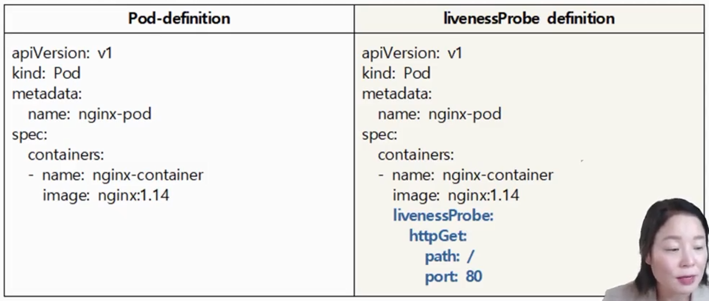
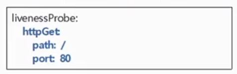
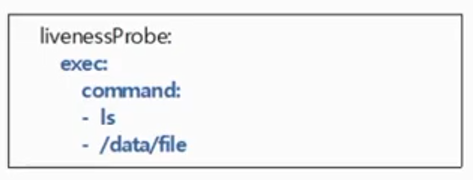
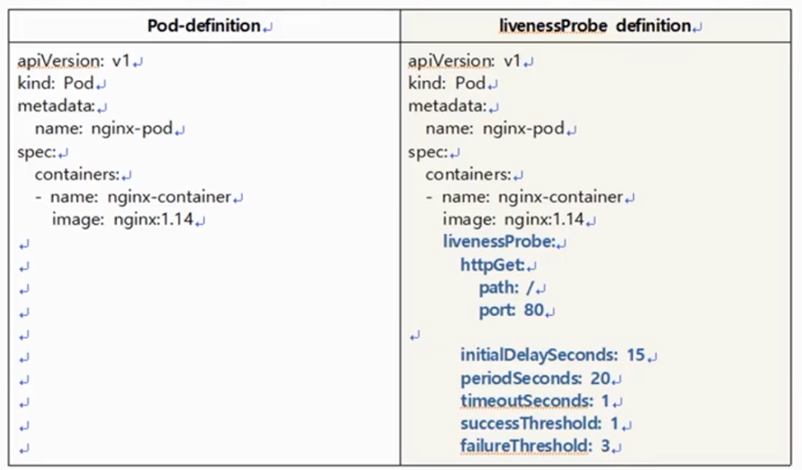

# 따배쿠 5-2 [libenessProbe를 이용해서 Self-healing Pod 만들기]

## livenessProbe를 이용해서 Self-healing Pod 만들기

---

### Self-healing

컨테이너가 제대로 동작 되지 못할 때 (fail) 재시작(restart)해주는 기능입니다.

즉, 건강한 컨테이너들만 가지고 애플리케이션 서비스를 하는 것을 보장한다고 할 수 있습니다.

[Official self-healing docs](https://kubernetes.io/ko/docs/concepts/workloads/controllers/replicationcontroller/#%EB%A0%88%ED%94%8C%EB%A6%AC%EC%BC%80%EC%9D%B4%EC%85%98-%EC%BB%A8%ED%8A%B8%EB%A1%A4%EB%9F%AC%EC%9D%98-%EB%8F%99%EC%9E%91-%EB%B0%A9%EC%8B%9D)

Self-healing 안에 포함된 것이 바로 **livenessProbe**입니다.

### Liveness Probe (1)

Pod가 계속 실행할 수 있음을 보장합니다.

Pod의 spec에 정의할 수 있습니다.

- livenessProbe:     #Pod가 Runnning 중일 때 livenessProbe를 통해 건강검진을 하겠다는 의미
    - httpGet:        # livenessProbe중에서도 httpGet Probe로 하겠다.
        - path: /
        - port: 80  # 80포트로 접속해서 잘 돌아가고 있는지 점검하겠다.

> 배가 아프면 안과를 가지 말고 내과를 가자.
웹 서비스는 웹 Prob로 점검하자.
> 

### Liveness Probe (2)

- httpGet Probe [웹 서비스 병원]
    
    
    
    - 지정한 IP주소, port, path에 HTTP GET 요청을 보내, 해당 컨테이너가 응답 하는지를 확인한다.
    - 반환 코드가 **200이 아닌 값이 나오면** 오류, **컨테이너를 다시 시작**한다.
        - **연속 세 번** 200이 아닌 값이 나오면 건강하지 않다고 판단.
            - 현재 컨테이너를 죽이고 Hub에서 다운 받은 새로운 (건강한) 컨테이너를 실행
- tcpSocket Probe [ssh 서비스 병원]
    
    
    
    - 지정된 port에 TCP 연결을 시도, **연결되지 않으면 컨테이너를 다시 시작**한다.
    - 22번으로 접속 했을 때 접속이 되면 건강하구나.
- exec Probe
    
    
    
    - exec 명령을 전달하고 명령의 종료코드가 **0이 아니면 컨테이너를 다시 시작**한다.
    - 예시
        
        > 백엔드의 데이터베이스로부터 특정 데이터를 가져와서 서비스하는 컨테이너가 있다.
        > 
        
        컨테이너 안에 데이터가 있는지 Pod가 확인해야 함.
        
        즉, 컨테이너 안에서 실행할 (건강 검진할 수 있는) 명령어를 명시
        

<aside>
💡 설사 컨테이너가 Restart되더라도 IP는 유지된다!

</aside>

### Liveness Probe (3)

- liveness probe 매개 변수
    - periodSeconds : health check 반복 실행 시간 (초)
        - default : 10 sec
    - initalDelaySeconds : Pod 실행 후 delay할 시간 (초)
        - default : 0 sec
    - timeoutSeconds : health check후 응답을 기다리는 시간 (초)
        - default : 1 sec