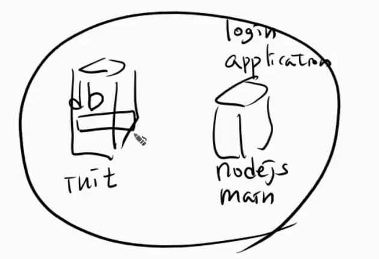
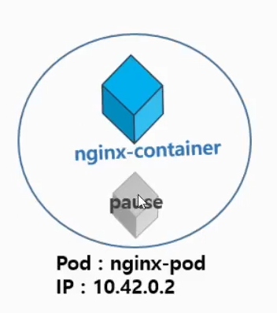
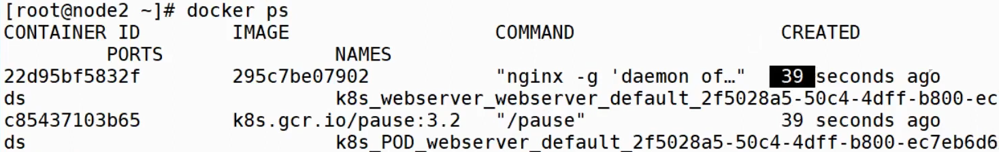
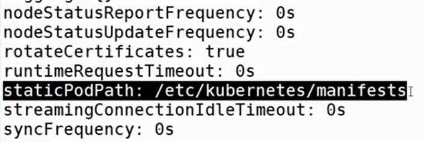
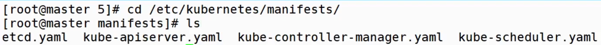
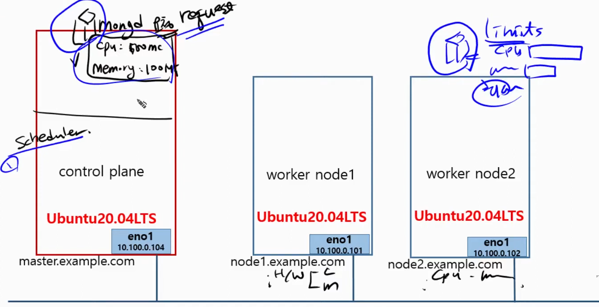
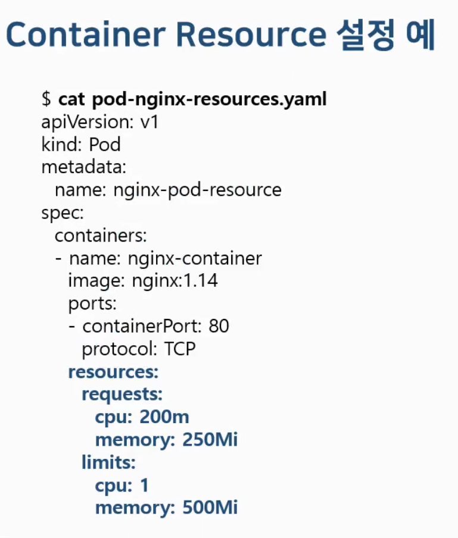
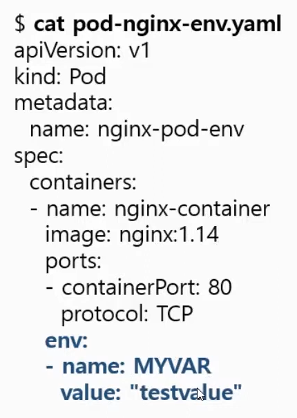
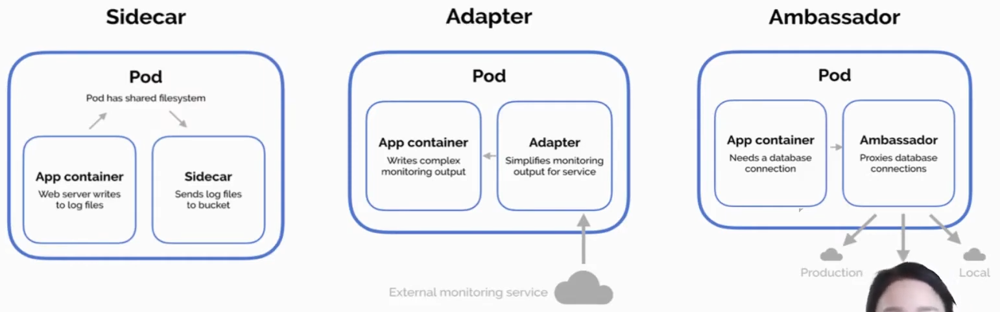

# **5주차 Pod**

---

## **박성배**

## Init Container

- 어떤 컨테이너를 실행하기 전에, 사전에 먼저 실행하는 컨테이너
- Init Container가 모두 실행 된 후에 실행 됨.

- Ex)

  - Login Application Container
    - 사전에 DB에서 로그인 정보를 가져와야함.
    - DB에 접속해서 정보를 가져오는 컨테이너가 Init container

- Ex)
  - Model Check
  - 사전 시스템 확인 등
    - DF 실행 전, STF가 제대로 실행되었는지 확인.
    - STF 실행 전, TTS가 제대로 실행되었는지 확인.

```yaml
apiVersion: v1
kind: Pod
metadata:
  name: myapp-pod # 파드 이름
  labels:
    app.kubernetes.io/name: MyApp
spec:
  containers:
    - name: myapp-container
      image: busybox:1.28
      command: ["sh", "-c", "echo The app is running! && sleep 3600"]
  initContainers: # Init 컨테이너
    - name: init-myservice # Init 컨테이너 1
      image: busybox:1.28
      command: [
          "sh",
          "-c",
          "until nslookup myservice.$(cat /var/run/secrets/kubernetes.io/serviceaccount/namespace).svc.cluster.local; do echo waiting for myservice; sleep 2; done",
        ] # myservice가 실행될 때까지.
    - name: init-mydb # Init 컨테이너 2
      image: busybox:1.28
      command: [
          "sh",
          "-c",
          "until nslookup mydb.$(cat /var/run/secrets/kubernetes.io/serviceaccount/namespace).svc.cluster.local; do echo waiting for mydb; sleep 2; done",
        ] # mydb가 실행될 때까지.
```

---

## Infra Container

- Pause는 Pod를 생성 시, 자동으로 생성 됨.
- Pod 마다 생성되고, 삭제될 때, 같이 삭제됨.
- Infra(IP, Host Name)를 관리 및 생성.

---

## Static Pod

- API에게 요청을 보내지 않음.
- Kubelet Daemon에 의해 동작.
- Pod를 실행하는 Node를 직접 선택 가능.
  - static pod path : 해당 노드의 /ete/kubernetes/maifests

---

## Pod에 Resource(cpu, memory) 할당

- Request
  - 최소의 리소스를 요청.
- Limit
  - Pod 리소스 제한.
- Memory
  - 1MB == 1000KB
  - 1MiB == 1024KiB
- CPU
  - 코어수로 할당
- GPU?
  - [GPU 할당 링크](https://kubernetes.io/ko/docs/tasks/manage-gpus/scheduling-gpus/)
  - 개수로 지정.
  - GPU 번호로 지정?

[CPU 할당 공식 링크](https://kubernetes.io/docs/tasks/configure-pod-container/assign-cpu-resource/)

```yaml
# CPU 할당
apiVersion: v1
kind: Pod
metadata:
  name: cpu-demo
  namespace: cpu-example
spec:
  containers:
    # 컨테이너 별로 리소스 제한
    - name: cpu-demo-ctr
      image: vish/stress
      resources:
        limits:
          cpu: "1"
        requests:
          cpu: "0.5"
      args:
        - -cpus
        - "2"
```

[메모리 할당 공식 링크](https://kubernetes.io/docs/tasks/configure-pod-container/assign-memory-resource/)

```yaml
# 메모리 할당
apiVersion: v1
kind: Pod
metadata:
  name: memory-demo
  namespace: mem-example
spec:
  containers:
    - name: memory-demo-ctr
      image: polinux/stress
      resources:
        requests:
          memory: "100Mi"
        limits:
          memory: "200Mi"
      command: ["stress"]
      args: ["--vm", "1", "--vm-bytes", "150M", "--vm-hang", "1"]
```

---

## 환경 변수

- 컨테이너가 실핼될 때, 필요로하는 변수
- 컨테이너 제작 시 미리 정의
- 변경 및 추가 가능

```yaml
apiVersion: v1
kind: Pod
metadata:
  name: envar-demo
  labels:
    purpose: demonstrate-envars
spec:
  containers:
    - name: envar-demo-container
      image: gcr.io/google-samples/node-hello:1.0
      # 환경 변수 설정
      env:
        - name: DEMO_GREETING
          value: "Hello from the environment"
        - name: DEMO_FAREWELL
          value: "Such a sweet sorrow"
```

---

## Pod 실행 패턴

- Sidecar
- Adapter
- Ambassador

---


# **Hans**

## Init container를 적용한 Pod

- Init container
    - 메인 컨테이너를 실행하는 데 필요로 하는 환경 세팅 or 초기화 구성을 지원해주는 컨테이너
    - 앱 컨테이너 실행 전에 미리 동작시킬 컨테이너
    - 본 컨테이너가 실행되기 전에 사전 작업이 필요할 경우 사용
    - 초기화 컨테이너가 모두 실행된 후에 앱 컨테이너를 실행
    
    
    
    - node js로 만들어진 login을 지원해주는 컨테이너 애플리케이션
    - 데이터 베이스에 접속해서 로그인에 관련된 정보를 가져와야 로그인을 수행할 수 있음
    - 이 때 데이터 베이스에 접속하여 정보들을 가져오는 컨테이너가 init container
    - init container가 성공해야 main container가 동작함.

## Infra container(pause) 이해하기

- Pod에 대한 IP, Hostname 등 인프라를 관리하고 생성해주는 컨테이너
    
    
    
    - pause 컨테이너는 Pod를 만들면 자동으로 (몰래) 만들어진다.
    - docker ps
        
        
        
        - 동작 중인 컨테이너 목록 확인 명령어
        - pause 컨테이너가 같이 생성됨
        - 삭제 할 때도 같이 삭제 됨

## Static Pod 만들기

- API 서버 없이 특정 노드에 있는 kubelet 데몬에 의해 직접 관리
- static pod는 api에게 요청을 보내지 않음
- kubelet의 static pod dir에 yaml 파일을 저장하면 알아서 컨테이너가 실행 됨
    - /etc/kubernetes/manifests/ 디렉토리에 k8s yaml파일을 저장 시 적용
    - Node
        - kubelet Daemon
            - static pod dir
                - yaml
- static pod path 알아내는 법
    - node 에 접속
    - `cat /var/lib/kubelet/config.yaml`
    - staticPodPath key 확인
        
        
        
- kubelet daemon 주의점
    
    config 파일을 수정하여 staticPodPath를 변경할 때 kubelet Daemon을 반드시 restart!
    
- static pod 삭제
    - yaml 파일 삭제하면 해당 pod 또한 삭제 됨
- master node에도 static dir 있음
    
    
    

## Pod에 리소스(cpu, memory) 할당하기



- Request
    - Pod를 실행하기 위한 최소 리소스 양 요청
    - Request가 너무 커서 할당이 안되는 경우 Pending 상태에서 머무르게 됨
- Limits
    - 파드가 사용할 수 있는 최대 자원 제한
    - Memoty limit을 초과하여 사용되는 파드는 종료되며 다시 스케쥴링 된다.
- 설정하는 법
    
    
    
    - Memory
        - 1MB = 1000 KB, 1MiB = 1024KB
    - CPU
        - 1 core = 1000m
        - 1 = 1 core
        - 200m = 0.2 core = 하나의 코어 20% 만큼

## Pod의 환경변수 설정하기

컨테이너가 빌드 될 때 환경변수를 삽입할 수 있음

- Pod내의 컨테이너가 실행될 때 필요로 하는 변수
- 컨테이너 제작 시 미리 정의
    - Nginx Dockerfile의 예
        - ENV NGINX_VERSION 1.19.2
        - ENV NJS_VERSION 0.4.3
- Pod 실행 시 미리 정의된 컨테이너 환경변수를 변경할 수 있다.
- 환경변수 사용 예
    
    
    
    아래에 -name, value로 환경변수를 더 입력할 수 있다.
    

### Pod 구성 패턴의 종류



- Sidecar
    - App container가 뭔가 만들어 주어야 실행할 수 있는 container
    - 혼자서는 움직일 수 없는 형태
    - 상당히 많은 환경에서 사용
- Adapter
    - 외부의 정보를  Adapter가 받아 App container로 송출
    - 외부와 통신
- Ambassador
    - 외부로부터 데이터를 받아 외부로 전달
---